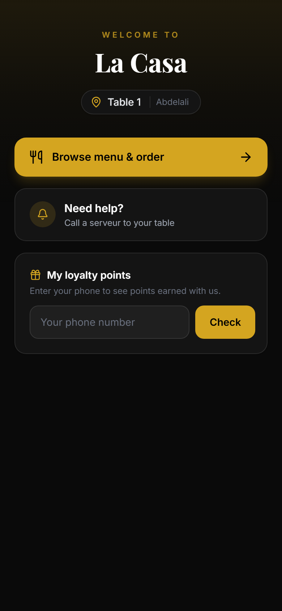
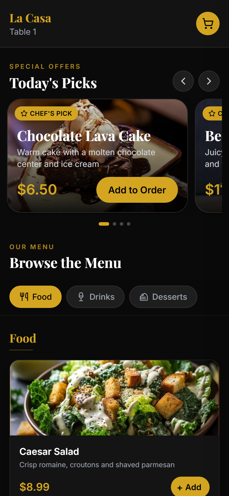
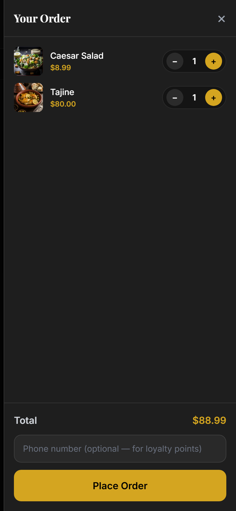
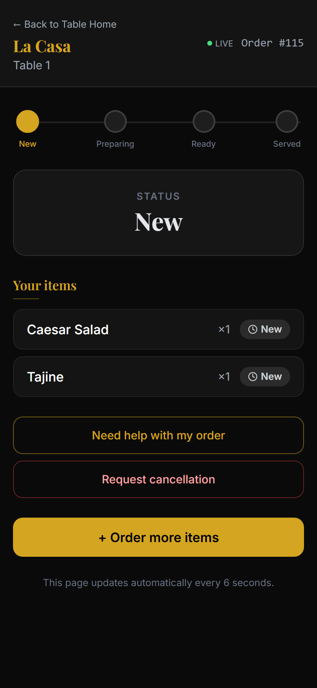
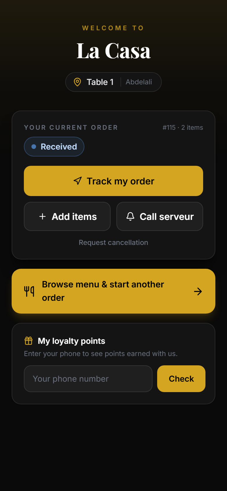
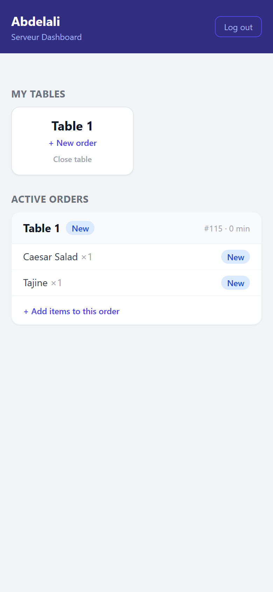
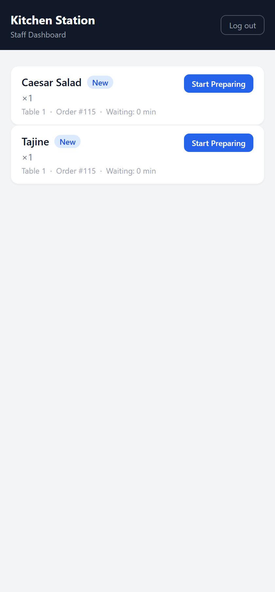
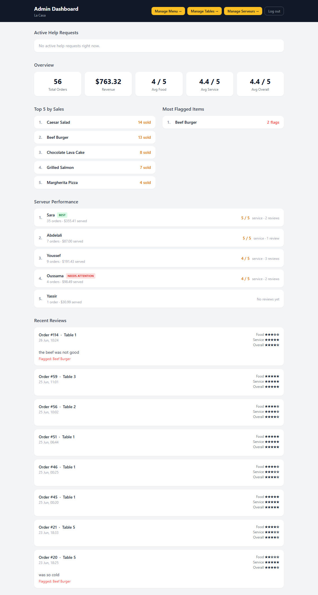

# 🍽️ Smart Restaurant Ordering & Loyalty System

A mobile-first restaurant ordering platform. Guests scan a table QR code, browse a
premium menu, order from their phone, track the kitchen in real time, call a serveur,
request a cancellation, and earn loyalty points — while serveurs, kitchen stations,
and the owner manage everything from role-based dashboards.

Built with **Django + DRF** and **vanilla JS + Tailwind (CDN)** — no build step, no
framework. Real-time updates use lightweight polling.

> Design decisions and rationale live in **[SPEC.md](SPEC.md)**.

---

## ✨ Key features

**Customer (phone, no login)**
- **Table Hub** welcome screen after the QR scan — one calm home for the table
- Premium **menu** with Today's Picks carousel, category scroll-spy nav, image cards
- **Cart** with quantity steppers, a floating "View order" bar, and live totals
- **Order tracking** with a live status stepper (New → Preparing → Ready → Served)
- **Call serveur** and **cancellation requests** straight from the phone
- **Loyalty points** by phone number; **reviews** after the meal is served

**Serveur** — passcode login; dashboard of assigned tables, active orders, ready-to-serve
queue, and customer requests; **assisted ordering**; approve/reject cancellations.

**Kitchen / Drinks / Dessert** — per-station queues, one-tap status advance, delay flags.

**Admin / Owner** — stats (revenue, ratings, top & flagged items), **per-serveur
performance**, menu management, table management, and serveur management.

**Safe table lifecycle** — each visit is an isolated **TableSession**: auto-opens on scan,
auto-closes on inactivity, and a new party starts fresh so they never see the previous
guest's order. Staff can Close a table manually. (See [SPEC.md](SPEC.md).)

---

## 🧱 Tech stack

| Layer | Choice |
|------|--------|
| Backend | Django 6.0, Django REST Framework 3.17 |
| Database | SQLite |
| Frontend | Vanilla JS + HTML + Tailwind CSS (CDN) — no npm/build |
| Real-time | Polling every 5–8 s (no WebSockets) |
| Auth | Phone-only customers; passcode logins for serveurs & staff |
| Testing | Playwright (mobile UI) + Django test client; pytest available |

---

## 🚀 Setup & run

Requires **Python 3.12+**.

```bash
# 1. Virtual environment
python -m venv .venv
# Windows (PowerShell):
.\.venv\Scripts\Activate.ps1
# macOS/Linux:
source .venv/bin/activate

# 2. Install dependencies
pip install -r requirements.txt

# 3. Database + demo data
python manage.py migrate
python manage.py seed_data        # restaurant, tables, serveurs, menu, passcodes

# 4. (optional) Django admin superuser
python manage.py createsuperuser

# 5. Run
python manage.py runserver
```

`seed_data` prints each table's QR token. Open the customer experience at:

```
http://127.0.0.1:8000/?table=<table-qr-token>
```

Other entry points: **Staff** `…/staff/login/` · **Serveur** `…/serveur/login/` · **Django admin** `…/admin/`.

Dev/testing tools (optional): `pip install -r requirements-dev.txt && playwright install chromium`.

---

## 🔑 Demo accounts (after `seed_data`)

| Role | Login page | Passcode |
|------|-----------|----------|
| Admin / Owner | `/staff/login/` | `4444` |
| Kitchen | `/staff/login/` | `1111` |
| Drinks | `/staff/login/` | `2222` |
| Dessert | `/staff/login/` | `3333` |
| Serveur — Sara | `/serveur/login/` | `2001` |
| Serveur — Youssef | `/serveur/login/` | `2002` |
| Serveur — Mehdi | `/serveur/login/` | `2003` |

Customers need no account — just the table link. (These are demo passcodes for a local
build; change them for any real deployment.)

---

## 📱 Main user flows

### 1. Customer
Scan QR → **Table Hub** → browse **menu** → add to **cart** → place order → **track** it
live → call serveur / request cancellation / leave a review → check **loyalty points**.

| Table Hub | Menu | Cart | Tracking |
|---|---|---|---|
|  |  |  |  |

The hub adapts once an order is live (track / add items / call / cancel):



### 2. Serveur
Passcode login → dashboard of **my tables**, **active orders**, **ready to serve**, and
**customer requests** (help + cancellations) → assisted ordering, mark served, approve/reject.



### 3. Staff / Kitchen
Passcode login → station queue (Kitchen / Drinks / Dessert) → advance each item
New → Preparing → Ready → Served; delayed orders are flagged.



### 4. Admin / Owner
Passcode login → live stats, per-serveur performance, recent reviews & flagged items,
plus menu / table / serveur management.



---

## ✅ Completed
- Customer Table Hub, menu, cart, order creation & "order more" append flow
- Real-time order tracking (polling) with status stepper and review-when-served
- Kitchen/Drinks/Dessert station dashboards with status advance + delay flags
- Loyalty points on served orders; reviews (food/service/overall + flag an item)
- Serveur model + passcode login, dashboard, and **assisted ordering**
- Admin dashboard: stats, **per-serveur analytics**, menu/table/serveur management
- **Tiered cancellation** (auto on NEW; serveur/admin approve-reject on PREPARING)
- Call-serveur & cancellation requests (`HelpAlert.kind`)
- **Automated TableSession lifecycle** for per-visit isolation & safety
- Premium mobile UI pass (hierarchy, cart bar, scroll-spy, offers carousel)

## 🔭 Future improvements
- **Dynamic menu categories** (model + admin UI + station routing) — next phase
- Online payments & bill splitting; per-person carts within a table
- Real-time push (WebSockets) instead of polling
- Customer accounts/loyalty tiers & redemption; loyalty phone verification (OTP)
- Cancellation execution beyond MVP (partial/per-item), refunds, undo
- Production hardening: `DEBUG=False`, managed secrets, secure cookies, HTTPS, rate limiting
- Rotating/NFC table tokens or staff-seating step (stronger presence proof)

---

*School MVP project. See [SPEC.md](SPEC.md) for scope and architecture decisions.*
